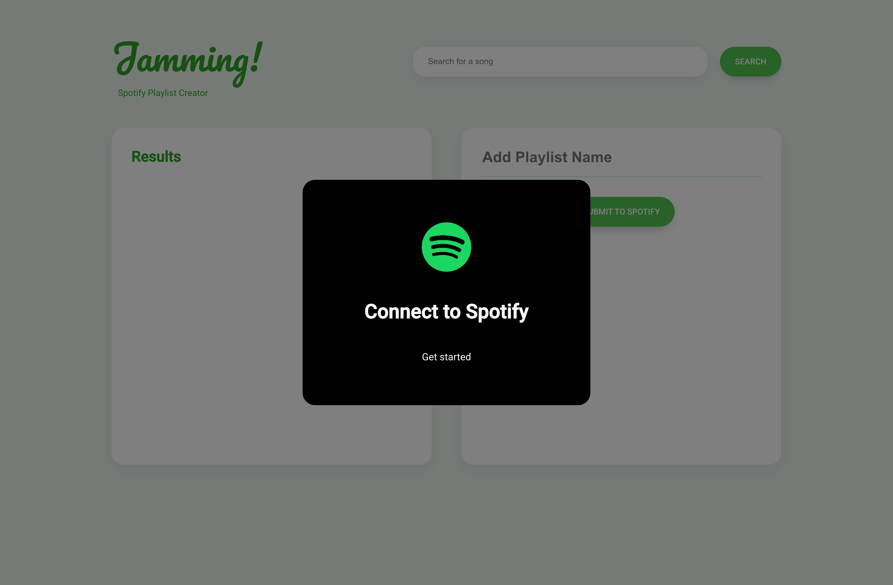
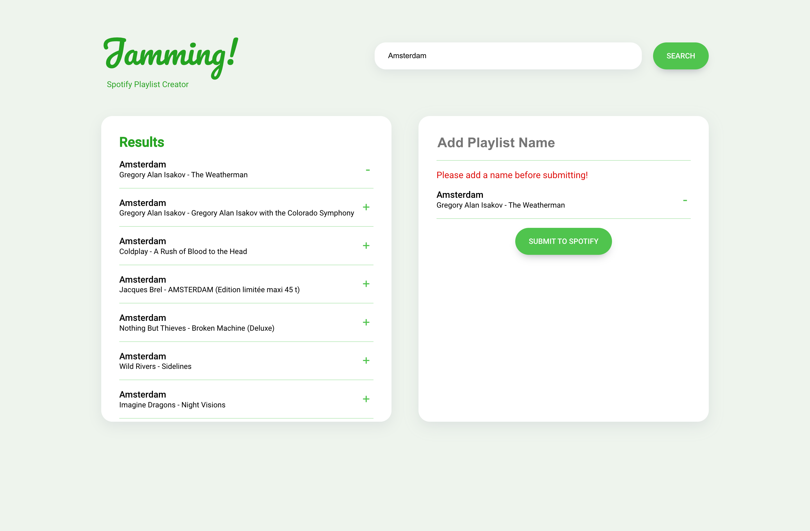
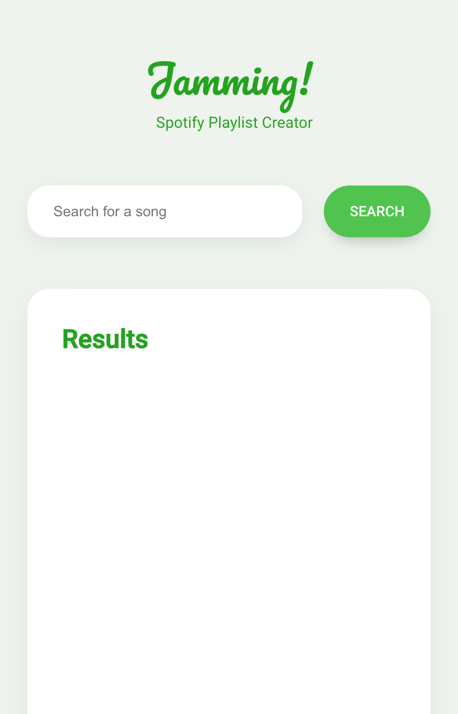
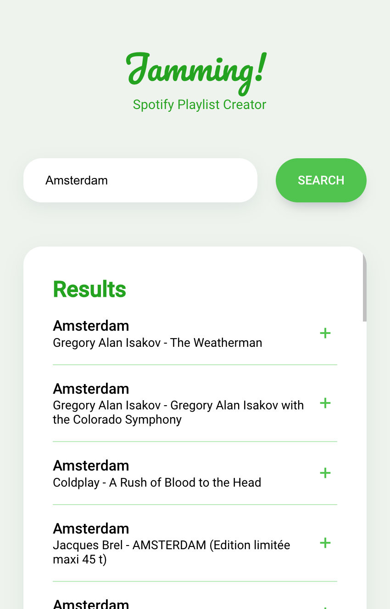

Jamming!
=======
A Spotify playlist creator web app.

## Purpose

To develop my skills as a web developer and practice implementing React, authentication, external API's, and responsive design.

## Final Product

**Connect to Spotify Prompt**

**Main Page with Error Message**

Mobile View       |  Mobile View with Results
:-------------------------:|:-------------------------:
  |  

## Features
- Users can search for songs by song title
- Users can see information about each song like title, artist, and album for songs they queried
- Users can export their custom playlist to their personal Spotify account

## Getting Started
Install the app dependencies running:

    $ npm install

Create an `.env` file by using `.env.example` as a reference.

You will need to register your app and get your own credentials from the [Spotify for Developers Dashboard](https://developer.spotify.com/dashboard).

- Create a new app in the dashboard and add `http://localhost:3000/` to the app's redirect URL list.
- Once you have created your app, update the `REACT_APP_CLIENT_ID` in the `.env` file with the value obtained from the app settings in the dashboard.

From a console shell:

    $ npm start

Then, open `http://localhost:3000` in a browser.

